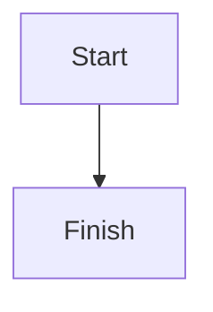

# Local Doc Renderer

Local Doc Renderer is a single-binary Go application that turns a folder of Markdown files into a browsable documentation site.

It is designed for local documentation workflows: notes, knowledge bases, project docs, and internal guides that live on disk.

## What This Project Does

- Serves Markdown files from a directory over HTTP.
- Renders Markdown to HTML with GitHub-flavored features.
- Builds a recursive sidebar from your folder structure.
- Adds client-side search across all Markdown files.
- Provides SPA-style navigation for faster page transitions.
- Generates an "On this page" table of contents from headings.
- Opens your browser automatically on startup by default.

## Rendering and Markdown Support

The renderer uses `goldmark` with these capabilities:

- GitHub Flavored Markdown (`extension.GFM`)
- Typographic replacements (`extension.Typographer`)
- Auto heading IDs (`parser.WithAutoHeadingID`)
- Syntax highlighting via `goldmark-highlighting` + Chroma
- Monokai highlight style and generated CSS classes
- Mermaid diagrams from fenced `mermaid` code blocks

Example Mermaid block:



## How It Works

1. The server starts on a requested port or an auto-selected free port.
2. It serves:
   - `GET /` for the root document (`README.md`)
   - `GET /search?q=<query>` for search results
   - `GET /<path>` for Markdown content
3. The frontend intercepts internal links and fetches partial JSON responses for SPA navigation.
4. Search data is indexed and cached server-side for 30 seconds.

## URL and File Resolution Rules

Given `--dir <content-root>`:

- `/` resolves to `<content-root>/README.md`
- `/guide/getting-started` attempts:
  - `<content-root>/guide/getting-started`
  - then `<content-root>/guide/getting-started.md`
- If a resolved path is a directory, server tries `<that-directory>/README.md`
- If nothing matches, returns `404`

Only `.md` files are included in navigation and search.

## Exclusions

The app skips hidden entries and common dependency folders:

- Hidden names (starting with `.`)
- `node_modules`
- `vendor`

Navigation additionally skips:

- `main.go`
- `go.mod`
- `go.sum`

## UI Features

- Sidebar file tree with directories first, then files, alphabetically.
- Collapsible folders with persisted state in `localStorage` (`openDirs` key).
- Active-page highlighting in navigation.
- Table of contents for `h1`, `h2`, `h3` headings.
- Intersection-based TOC active section tracking.
- Full-text search with title prioritization, snippets, and keyboard navigation.
- Mobile sidebar toggle for narrow screens.
- Lightweight loading/progress indicator during SPA page changes.

## CLI and Configuration

### Flags

- `-dir string`
  - Markdown root directory.
  - Default: current directory (`.`)
- `-port string`
  - Port to bind.
  - Default: empty, so OS auto-selects a free port (`:0`)
- `-open`
  - Open default browser after startup.
  - Default: `true`
  - Disable with `-open=false`

### Environment Variables

- `PORT`
  - If set, overrides `-port`

## Running the App

### Use a release binary (no Go install needed)

1. Download the latest binary for your OS from the project Releases page.
2. Put the binary inside your markdown notes directory.
3. Run it from that same directory.
   - You can also start it by double-clicking the binary directly (for example, `local-doc-renderer.exe` on Windows).

Because the default docs directory is `.`, placing and running the binary in your notes folder means it will immediately serve those markdown files.

Example:

```bash
# Windows
local-doc-renderer.exe

# macOS / Linux
./local-doc-renderer
```

If your binary is in a different location, pass the notes path explicitly with `-dir`.

### Run from source

```bash
go run . -dir .
```

### Build binary

```bash
go build -o local-doc-renderer .
```

### Example runs

```bash
# Auto-select port and open browser
./local-doc-renderer -dir ./docs

# Fixed port
./local-doc-renderer -dir ./docs -port 8080

# Do not auto-open browser
./local-doc-renderer -dir ./docs -open=false
```

On startup it prints:

- Absolute docs directory path
- Local URL (localhost)
- Network URL (LAN IP)

## Search Endpoint

`GET /search?q=<query>` returns an array of up to 12 results:

- `title`: file name without `.md`
- `path`: relative path from docs root
- `snippet`: surrounding text excerpt for the matched query

This endpoint sets:

- `Content-Type: application/json`
- `Cache-Control: no-store`

Notes:

- Empty/whitespace-only queries return an empty array.
- Title matches are ranked above content-only matches.

## Architecture Summary

- Backend: single `main.go` file with HTTP handlers, file walkers, and template rendering
- Frontend: inline HTML/CSS/JS template served by Go `html/template`
- Search: server-side matching (`/search`) over a cached markdown index
- State:
  - Server cache for search/nav data with RWMutex
  - Browser localStorage for open folder state

## Project Structure

- `main.go`: server, Markdown rendering, templates, SPA script
- `go.mod`, `go.sum`: module and dependencies
- `README.md`: documentation
- `samples/`: sample docs (small examples, code block playground, and one larger walkthrough)

## Intended Use and Limitations

- Intended for local or trusted-network documentation browsing.
- No authentication/authorization layer is built in.
- Search is in-memory and simple substring matching.
- Not intended as a multi-tenant or internet-exposed documentation platform without additional hardening.
