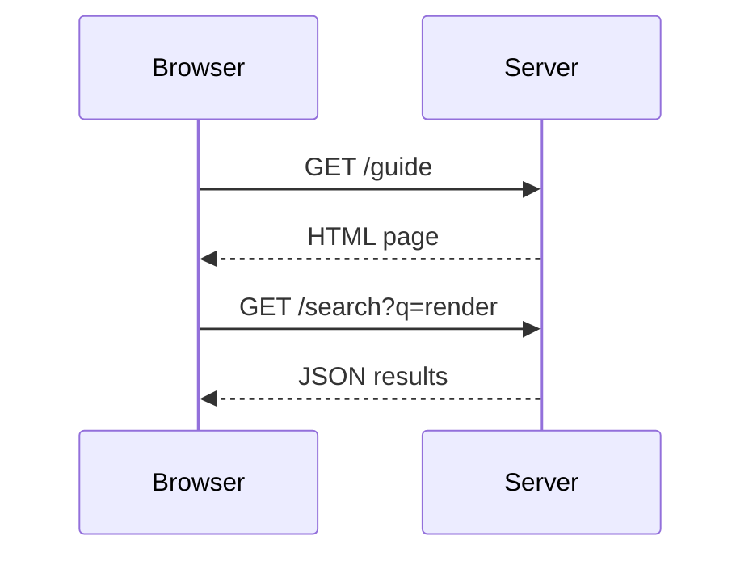

# Codeblocks Playground

Use this page to verify syntax highlighting for common languages.

## Go

```go
package main

import "fmt"

func main() {
	fmt.Println("hello from Go")
}
```

## JavaScript

```javascript
const users = [
  { id: 1, name: "Alice" },
  { id: 2, name: "Bob" }
];

const names = users.map((u) => u.name).join(", ");
console.log(`Users: ${names}`);
```

## Python

```python
def slugify(text: str) -> str:
    return text.strip().lower().replace(" ", "-")

print(slugify("Local Doc Renderer"))
```

## SQL

```sql
SELECT id, email, created_at
FROM users
WHERE is_active = true
ORDER BY created_at DESC
LIMIT 20;
```

## YAML

```yaml
service:
  name: local-doc-renderer
  port: 8080
  open_browser: false
```

## Dockerfile

```dockerfile
FROM golang:1.25-alpine AS build
WORKDIR /app
COPY . .
RUN go build -o local-doc-renderer .

FROM alpine:3.21
WORKDIR /docs
COPY --from=build /app/local-doc-renderer /usr/local/bin/local-doc-renderer
ENTRYPOINT ["local-doc-renderer"]
```

## Mermaid Sequence Diagram



