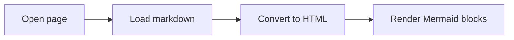

# Quick Reference

This is a compact sample file that mixes common markdown features.

## Checklist

- [x] Heading structure
- [x] Lists and links
- [x] Mermaid diagram
- [x] Standard fenced code blocks

## Table

| Item | Value | Notes |
| --- | --- | --- |
| Renderer | Goldmark | GitHub-flavored markdown |
| Highlighting | Chroma | Monokai style |
| Diagrams | Mermaid | Rendered client-side |

## Mermaid Flowchart



## Shell Snippet

```bash
./local-doc-renderer -dir ./samples -open=false
```

## JSON Snippet

```json
{
  "title": "Example payload",
  "enabled": true,
  "tags": ["docs", "sample", "renderer"]
}
```

