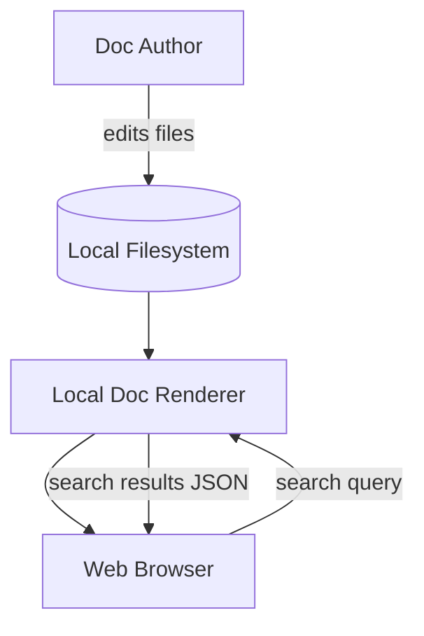
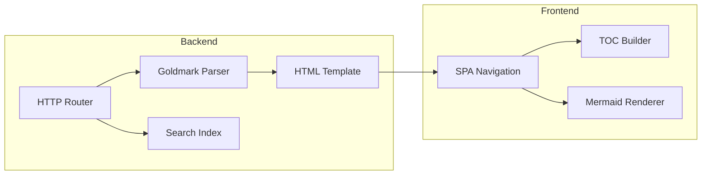
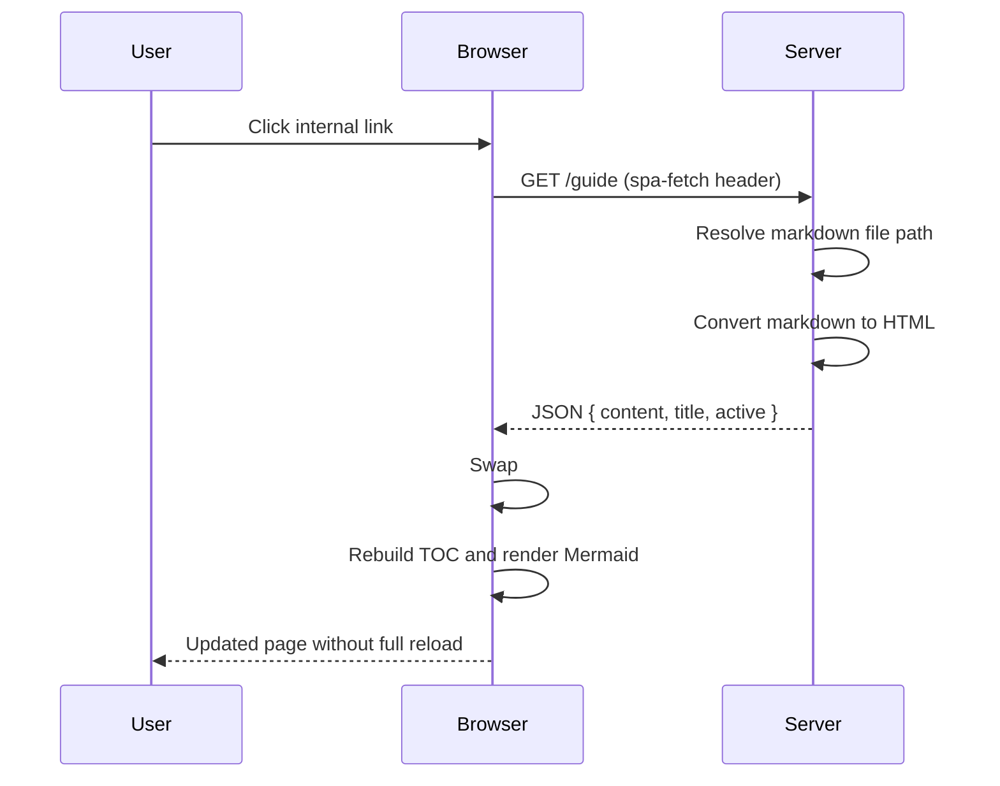
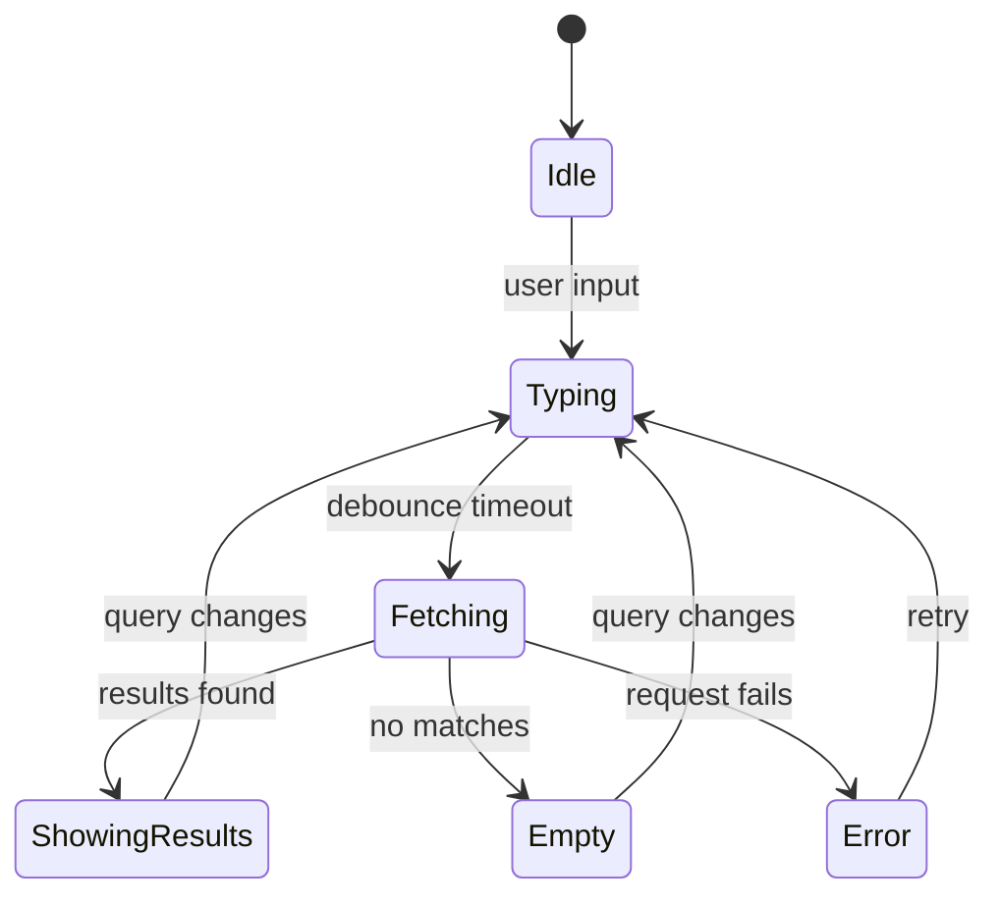

# System Design Walkthrough

This is a larger sample markdown document meant to exercise:

- deep heading structure
- multiple Mermaid diagram types
- long prose sections
- varied fenced code blocks
- tables and checklists

## 1. Problem Statement

We need a local documentation platform for engineering teams that:

- serves markdown files from disk
- supports diagrams and syntax highlighting
- keeps navigation fast with SPA-style transitions
- works without external services

## 2. Functional Requirements

| ID | Requirement | Priority |
| --- | --- | --- |
| FR-1 | Render `.md` files to HTML | High |
| FR-2 | Build recursive sidebar nav | High |
| FR-3 | Provide full-text search endpoint | High |
| FR-4 | Render Mermaid diagrams in docs | Medium |
| FR-5 | Keep browser history/navigation consistent | Medium |

## 3. Non-Functional Requirements

- Startup under 1 second on a typical laptop.
- Search response under 100 ms for small/medium doc sets.
- No dependency on external CDN for core functionality.
- Works on macOS, Linux, and Windows.

## 4. Context Diagram



## 5. Component View



## 6. Request Lifecycle



## 7. Example API Shapes

### Search response

```json
[
  {
    "title": "getting-started",
    "path": "guide/getting-started.md",
    "snippet": "...render markdown to HTML..."
  }
]
```

### SPA page payload

```json
{
  "content": "<h1>Guide</h1><p>...</p>",
  "title": "getting-started.md",
  "active": "guide/getting-started.md"
}
```

## 8. Data Structures

```go
type SearchResult struct {
	Title   string `json:"title"`
	Path    string `json:"path"`
	Snippet string `json:"snippet"`
}

type Node struct {
	Name     string
	Path     string
	IsDir    bool
	Children []*Node
}
```

## 9. Example Handler Skeleton

```go
func handler(w http.ResponseWriter, r *http.Request) {
	fullPath, err := resolveRequestedFile(r.URL.Path)
	if err != nil {
		http.NotFound(w, r)
		return
	}

	content, err := os.ReadFile(fullPath)
	if err != nil {
		http.Error(w, "Error reading file", http.StatusInternalServerError)
		return
	}

	var buf bytes.Buffer
	if err := md.Convert(content, &buf); err != nil {
		http.Error(w, "Error rendering markdown", http.StatusInternalServerError)
		return
	}

	_ = buf.String()
}
```

## 10. Queue Worker Example (Pseudo Background Job)

```python
from queue import Queue
from threading import Thread

jobs = Queue()

def index_worker():
    while True:
        path = jobs.get()
        if path is None:
            break
        print(f"indexing {path}")
        jobs.task_done()

Thread(target=index_worker, daemon=True).start()
```

## 11. SQL Example for Future Persistence

```sql
CREATE TABLE docs (
    id INTEGER PRIMARY KEY,
    path TEXT NOT NULL UNIQUE,
    title TEXT NOT NULL,
    content TEXT NOT NULL,
    indexed_at TIMESTAMP NOT NULL
);

CREATE INDEX idx_docs_title ON docs(title);
```

## 12. Configuration Example

```yaml
server:
  port: 8080
  open_browser: false
  allow_network: false

search:
  cache_ttl_seconds: 30
  max_results: 12
```

## 13. Release Script Example

```bash
set -euo pipefail

go test ./...
go build -o dist/local-doc-renderer .
echo "Build complete: dist/local-doc-renderer"
```

## 14. State Diagram for Search UX



## 15. Rollout Checklist

- [x] Serve markdown pages
- [x] Add SPA navigation
- [x] Add search endpoint
- [x] Add Mermaid support
- [ ] Add automated tests
- [ ] Add CI job for lint and test

## 16. Notes

If you are testing rendering quality, this file is intentionally long and varied.
It should stress TOC generation, scrolling behavior, code highlighting, and Mermaid handling in one place.

